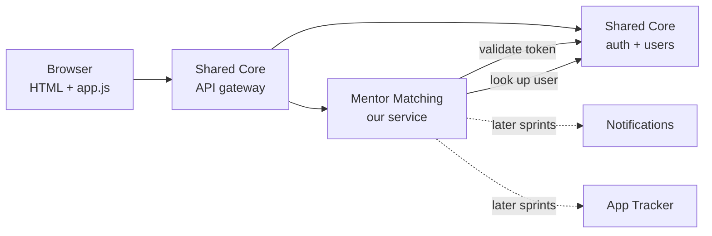
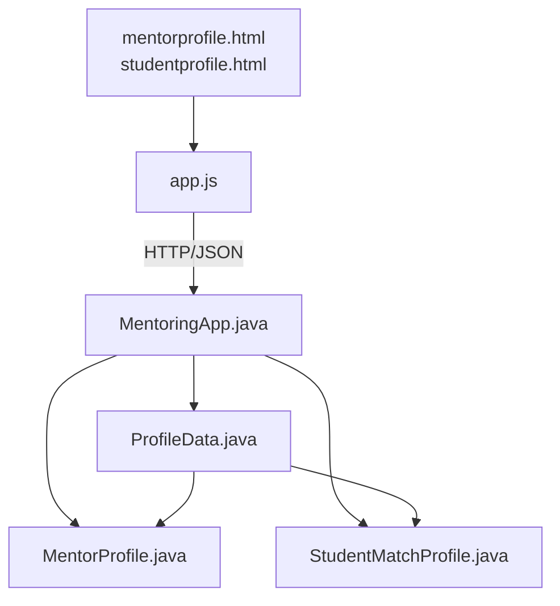
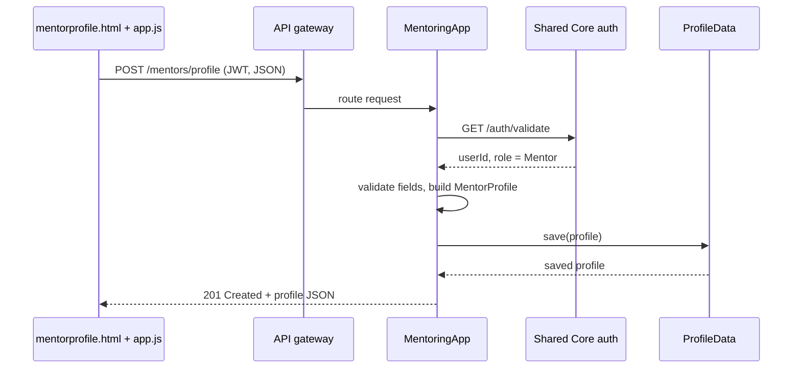

# Mentor Matching: Sprint 1 Architecture

Subsystem 4 of Mason CareerLaunch. Decisions are recorded in [`/docs/adr`](adr/). Interface contracts live on the project wiki.

## Overview and Sprint 1 scope

Sprint 1 delivers a walking skeleton of Subsystem 4: a mentor or student can create, view and update their matching profile end to end, through a containerized Java service behind the Shared Core gateway. Matching logic, connections and scheduling come in later sprints, but the profile design is shaped so the matching algorithm drops in without a schema change.

**In scope for Sprint 1**

- Create, read and update a mentor profile
- Create, read and update a student matching profile
- Paginated, filterable mentor directory (`GET /mentors`)
- Architecture decisions recorded, interface contracts v1 on the wiki, Dockerfile that builds and runs

**Out of scope for Sprint 1:** recommendations, connection requests, session scheduling, notifications.

## Architectural pattern

We build a layered service inside a client-server system fronted by an API gateway. CareerLaunch as a whole is eight independently containerized services that talk over REST/JSON, all routed and authenticated through the Shared Core gateway. Inside our container we keep strict layers so each one can be tested alone and swapped later.

Solid arrows are Sprint 1 calls; dotted arrows are dependencies we design for now but wire up later.

## Module view

Each file in the Sprint 1 structure owns exactly one layer, and dependencies only point downward.

| File | Layer | Responsibility |
| - | - | - |
| `mentorprofile.html`, `studentprofile.html` | Presentation | Forms to create and edit each profile type; no logic beyond layout |
| `app.js` | Presentation | Reads form values, calls our REST endpoints with the auth token, renders results and field errors |
| `MentoringApp.java` | API / controller | Entry point: starts the server, defines routes, validates the token via Shared Core, validates input, returns the shared error format |
| `MentorProfile.java` | Domain | Mentor fields plus rules (e.g. mentee capacity cannot go below current mentees) |
| `StudentMatchProfile.java` | Domain | Student matching fields plus rules (at least one target industry or guidance area) |
| `ProfileData.java` | Persistence | Save, find, update and list profiles; the only class that knows how data is stored |

As the service grows, split `MentoringApp.java` into one controller per resource and keep it as the bootstrap only. Put the guidance-area and industry lists in a shared enum file (see ADR-002).

## Component and connector view

The walking skeleton is one flow: a mentor submits the profile form and sees the saved profile come back.

Failure paths every endpoint must handle, per SOW Section 6:

- Missing or bad token: `401`; wrong role (e.g. a student creating a mentor profile): `403`
- Missing or malformed fields: `400` with per-field detail, never an unhandled exception
- All errors use `{"error": "...", "code": "...", "detail": "..."}`

The student flow is identical against `studentprofile.html` and `POST /students/match-profile`.

## Data model

Both profiles hold only matching-specific fields and point to the Shared Core `User` by `userId`. Name, GMU email, program, graduation year, employer and title already live in the Shared Core base profile, so we read them from `GET /users/{id}` instead of copying them (SOW Section 4 constraint).

**MentorProfile**

| Field | Type | Notes |
| - | - | - |
| `userId` | UUID | FK to Shared Core User; one profile per user |
| `industry` | enum `Industry` | Shared list with student profile |
| `guidanceAreas` | set of enum `GuidanceArea` | Resume review, mock interviews, industry insight, negotiation, general career, technical domain |
| `technicalDomains` | list of string | Only when `TECHNICAL_DOMAIN` is offered |
| `hoursPerMonth` | int | 1 to 40 |
| `contactMethod` | enum | Email, video call, phone |
| `maxMentees` | int | Capacity; matching later uses `maxMentees - activeMentees` |
| `activeMentees` | int | Starts at 0; updated by connections in Sprint 3 |
| `acceptingMentees` | boolean | Lets a mentor pause without deleting the profile |
| `createdAt`, `updatedAt` | timestamp | |

**StudentMatchProfile**

| Field | Type | Notes |
| - | - | - |
| `userId` | UUID | FK to Shared Core User; one profile per user |
| `targetIndustries` | set of enum `Industry` | Same list as mentors |
| `targetRoles` | list of string | e.g. SWE intern, data analyst |
| `guidanceWanted` | set of enum `GuidanceArea` | Same list as mentors |
| `targetCompanies` | list of string | Preferred mentor background |
| `preferSameProgram` | boolean | Preferred mentor background |
| `createdAt`, `updatedAt` | timestamp | |

Because both sides use the same `Industry` and `GuidanceArea` enums, the future matching score is a set overlap, not text parsing.

## Interface contracts

See the project wiki page **Mentor Matching: Interface Contracts v1**. The wiki is the source of truth for other teams.

## Allocation view

The whole subsystem ships as one Docker container that runs with `docker build` and `docker run` and nothing else.

- **Container:** a `Dockerfile` at the repo root builds the Java service and serves the HTML/JS pages from the same process on one port.
- **Configuration by environment variables:** `SHARED_CORE_URL`, `DB_URL`, `PORT`. Nothing hard-coded, so the Week 13 docker-compose environment can wire us in.
- **Repo layout:** backend source, `/static` for HTML/JS, `/docs/ai-log/` for AI prompt logs, `/docs/adr/` for decision records.
- **People:** Sprint 1 work splits by layer (frontend forms, API and validation, domain and persistence, Docker and wiki contracts). One member rotates to the Quality & Integration Team each sprint.
- **Cadence:** Friday 4:30 pm sync reviews any contract or ADR change before it is merged.

## Risks and open questions

| Risk | Fallback |
| - | - |
| Shared Core auth is late | Stub `GET /auth/validate` behind a config flag that returns a fixed test user; remove before Sprint 2 |
| Profile storage location unclear | ADR-001 isolates it in `ProfileData`; ask Shared Core in Week 3 |
| Mentor supply far below student demand | Capacity fields exist from day one so matching can respect them |
| Endpoint paths clash in the gateway | Confirm the `/mentors` and `/students` prefixes with Shared Core before posting contracts |

- [ ] Does Shared Core want our extended fields stored in its user data layer, or in our own tables?
- [ ] Final `Industry` and `GuidanceArea` value lists, agreed with Subsystems 2 and 8
- [ ] Framework decision for ADR-004 at the next Friday sync
