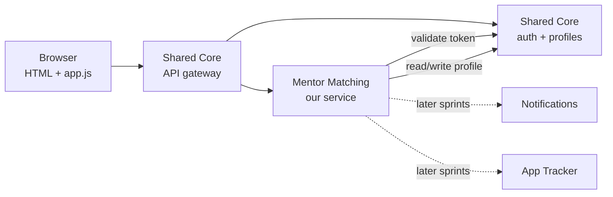
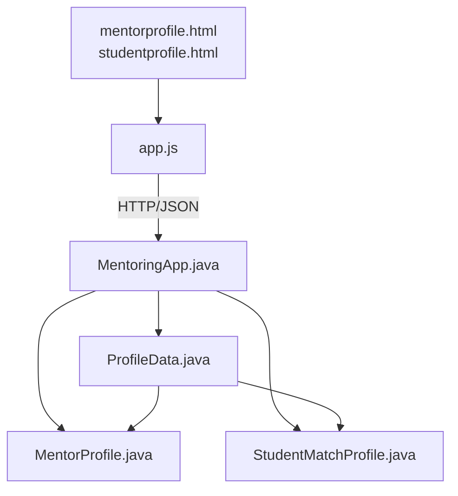
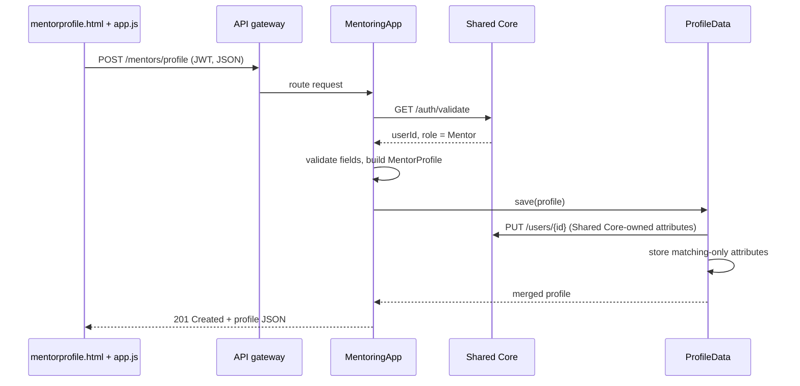

# Mentor Matching: Sprint 1 Architecture

Subsystem 4 of Mason CareerLaunch. Decisions are recorded in [`/docs/adr`](adr/). Interface contracts live on the project wiki.

## Overview and Sprint 1 scope

Sprint 1 delivers a walking skeleton of Subsystem 4: a mentor or student can create, view and update their matching profile end to end, through a containerized Java service behind the Shared Core gateway. Matching logic, connections and scheduling come in later sprints, but the profile design is shaped so the matching algorithm drops in without a schema change.

**In scope for Sprint 1**

- Create, read and update a mentor profile
- Create, read and update a student matching profile
- Paginated, filterable mentor directory (`GET /mentors`)
- Architecture decisions recorded, interface contracts v1 on the wiki, Dockerfile that builds and runs

**Out of scope for Sprint 1:** recommendations, connection requests, session scheduling, notifications.

## Architectural pattern

We build a layered service inside a client-server system fronted by an API gateway. CareerLaunch as a whole is eight independently containerized services that talk over REST/JSON, all routed and authenticated through the Shared Core gateway. Inside our container we keep strict layers so each one can be tested alone and swapped later.

Solid arrows are Sprint 1 calls; dotted arrows are dependencies we design for now but wire up later.

## Module view

Each file in the Sprint 1 structure owns exactly one layer, and dependencies only point downward.

| File | Layer | Responsibility |
| - | - | - |
| `mentorprofile.html`, `studentprofile.html` | Presentation | Forms to create and edit each profile type; no logic beyond layout |
| `app.js` | Presentation | Reads form values, calls our REST endpoints with the auth token, renders results and field errors |
| `MentoringApp.java` | API / controller | Entry point: starts the server, defines routes, validates the token via Shared Core, validates input, returns the shared error format |
| `EditProfile.java` | API / controller | Handles `PUT` for the caller's own profile, using the role in the token to choose mentor or student; loads the profile through `ProfileData`, updates only the matching attributes we own (Shared Core fields are read through its API but never edited here, and `activeMentees` is system-managed), re-runs the domain rules, saves to our store and returns the updated profile or the shared error format |
| `MentorProfile.java` | Domain | Mentor fields plus rules (e.g. mentee capacity cannot go below current mentees) |
| `StudentMatchProfile.java` | Domain | Student matching fields plus rules (at least one target industry or guidance area) |
| `ProfileData.java` | Persistence | Save, find, update and list profiles; the only class that knows which attributes come from Shared Core and which we store ourselves |

As the service grows, split `MentoringApp.java` into one controller per resource and keep it as the bootstrap only. Put the guidance-area and industry lists in a shared enum file (see ADR-002).

## Component and connector view

The walking skeleton is one flow: a mentor submits the profile form and sees the saved profile come back.

Failure paths every endpoint must handle, per SOW Section 6:

- Missing or bad token: `401`; wrong role (e.g. a student creating a mentor profile): `403`
- Missing or malformed fields: `400` with per-field detail, never an unhandled exception
- All errors use `{"error": "...", "code": "...", "detail": "..."}`

The student flow is identical against `studentprofile.html` and `POST /students/match-profile`.

## Data model

Shared Core will provide a base profile class plus an extended class for each of four types (we assume the four SOW roles: Student, Mentor, Career Services Staff, Platform Admin). We depend on the Mentor and Student extensions. Which attributes go in those extensions versus our service is not agreed yet, so the tables list every attribute matching needs with a proposed owner. Our classes hold `userId` and map Shared Core's JSON; they never inherit from Shared Core classes (ADR-003).

**MentorProfile**

| Attribute | Type | Proposed owner | Notes |
| - | - | - | - |
| `userId` | UUID | Shared Core | Key linking everything |
| name, email, program, grad year | various | Shared Core | Base profile per SOW |
| `employer`, `title` | string | Shared Core | SOW puts these in the mentor base profile |
| `industry` | enum `Industry` | TBD | Describes the person, so likely Shared Core |
| `guidanceAreas` | set of enum `GuidanceArea` | Us | Resume review, mock interviews, industry insight, negotiation, general career, technical domain |
| `technicalDomains` | list of string | Us | Only when `TECHNICAL_DOMAIN` is offered |
| `hoursPerMonth` | int | TBD | 1 to 40 |
| `contactMethod` | enum | TBD | Email, video call, phone |
| `maxMentees` | int | Us | Capacity used by matching |
| `activeMentees` | int | Us | Updated by connections in Sprint 3 |
| `acceptingMentees` | boolean | Us | Pause without deleting the profile |

**StudentMatchProfile**

| Attribute | Type | Proposed owner | Notes |
| - | - | - | - |
| `userId` | UUID | Shared Core | Key linking everything |
| name, email, program, grad year | various | Shared Core | Base profile per SOW |
| `targetIndustries` | set of enum `Industry` | TBD | Subsystem 2 may also use it |
| `targetRoles` | list of string | TBD | Subsystem 2 may also use it |
| `guidanceWanted` | set of enum `GuidanceArea` | Us | Same enum as mentors |
| `targetCompanies` | list of string | Us | Preferred mentor background |
| `preferSameProgram` | boolean | Us | Preferred mentor background |

Rule for settling the TBD rows: attributes that describe the person go to Shared Core; attributes that only matter for matching stay with us. If `industry` lands in Shared Core, they need to use the same `Industry` enum values so matching stays a set overlap.

## Interface contracts

See the project wiki page **Mentor Matching: Interface Contracts v1**. The wiki is the source of truth for other teams.

## Allocation view

The whole subsystem ships as one Docker container that runs with `docker build` and `docker run` and nothing else.

- **Container:** a `Dockerfile` at the repo root builds the Java service and serves the HTML/JS pages from the same process on one port.
- **Configuration by environment variables:** `SHARED_CORE_URL`, `DB_URL`, `PORT`. Nothing hard-coded, so the Week 13 docker-compose environment can wire us in.
- **Repo layout:** backend source, `/static` for HTML/JS, `/docs/ai-log/` for AI prompt logs, `/docs/adr/` for decision records.
- **People:** Sprint 1 work splits by layer (frontend forms, API and validation, domain and persistence, Docker and wiki contracts). One member rotates to the Quality & Integration Team each sprint.
- **Cadence:** Friday 4:30 pm sync reviews any contract or ADR change before it is merged.

## Risks and open questions

| Risk | Fallback |
| - | - |
| Shared Core auth or profile endpoints are late | Stub `/auth/validate` and `/users/{id}` behind a config flag; remove before Sprint 2 |
| Attribute split with Shared Core not agreed | Proposed-owner columns in the data model; `ProfileData` isolates the change |
| Mentor supply far below student demand | Capacity attributes exist from day one so matching can respect them |
| Endpoint paths clash in the gateway | Confirm the `/mentors` and `/students` prefixes with Shared Core before posting contracts |

- [ ] Get the attribute list and types for Shared Core's Mentor and Student extended classes, then settle the TBD rows
- [ ] Confirm the four extended types are the four SOW roles
- [ ] Final `Industry` and `GuidanceArea` value lists, agreed with Shared Core and Subsystems 2 and 8
- [ ] Framework decision for ADR-004 at the next Friday sync
